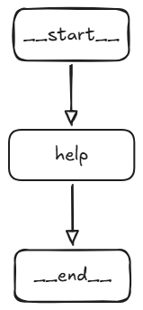

#  LangGraph Tutorial

This tutorial demonstrates the use of langgraph in AI application implementation. The application is an enhaced version of student AI assistant called **ChatMIT**. It utilizes memory to manages the conversational history

The application should remember the details from previous conversations as shown below:
- *You: Hi, My name is Krishna*
- *ChatMIT: Hi Krisha, ....*
- *You: What is my name?*
- *ChatMIT: Your name is Krisha*

The application uses:
- **LLaMa 3.3** as the LLM
- **Groq** for Inference provider
- **LangChain and LangGraph** for Agent framework
- **Streamlit** for a rendering the UI

## Architecture



---

## Folder structure
```
ai-lab2/
│
├── agent/ 
│   ├── graph.py 
│   ├── nodes.py
│   └── state.py 
├── app.py 
├── README.md 
├── requirements.txt
└── .env 
```
---

Note: Step1 and Step2 below, are one-time activities.They can be skipped, if they are already completed during ai-lab1
## Step 1: Setup the code files

If **git** utility is available, setup code files using **git** as mentioned below  
Create a folder named ```training``` under C: drive  
Run the following commands to clone the repository
```
cd C:\training

git clone https://github.com/nithinpv/gen-ai-labs.git
```
Or  
If **git** utility is not available, setup code files as mentioned below  

Go to https://github.com/nithinpv/gen-ai-labs  
Click on **"<> Code"** and select **"Download Zip"**  
Unzip the file. Replace the existing destination path with ```C:\training``` while extraction  
After extraction rename the newly created folder from ```gen-ai-labs-main``` to ```gen-ai-labs```

---

## Step 2: Create a Groq API key

We will be using inference provider named **Groq** to access an LLM.

Go to https://console.groq.com  
Sign in or create a new account  
Click on **“API keys”** shown on the right side of the top banner  
Click on **“Create API key”**  
Copy the generated API key  

---

## Step 3: Set up environment variables
Open the ```C:\training\gen-ai-labs``` folder in vscode.  
Select the ```ai-lab2``` folder and create a new file with name ```".env"``` under it.  
Note: The full file name is ```".env"```. No other prefix or suffix should be given.  
Add the following code to this file. 

```env
GROQ_API_KEY=<value>
```
Replace ```<value>``` with the API key copied in the previous step 

---
## Step 4: Setup python enviroment and install dependencies

Open the terminal in vscode and execute the following commands
```
cd C:\training\gen-ai-labs

python -m venv .venv

.venv\Scripts\Activate.ps1 
```
Note: For command prompt use ```.venv\Scripts\activate.bat ``` instead.  
Verify that the terminal prompt shows ```(.venv)``` indicating that the virtual enviroment is active  
Install the python libraries using the following commands
```
cd C:\training\gen-ai-labs\ai-lab2

pip install -r requirements.txt
```

---
## Step 5: Run the application

```
cd C:\training\gen-ai-labs\ai-lab2

streamlit run app.py
```
Your browser will open automatically with the UI.

