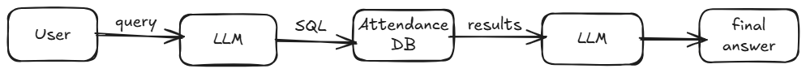

#  RAG (Retrieval-Augmented Generation) Tutorial

This tutorial demonstrates how to build a small but realistic AI system. It answers natural language questions over **student attendance data** stored in a relational database.

The application will answer to questions like:
- *Which students have less than 50% attendance in Physics?*
- *What is the average attendance of ECE branch in Jan?*
- *What is the average attendance on Amit in Chemistry?*

The application uses:
- **LLaMa 3.3** as the LLM
- **Groq** for Inference provider
- **LangChain** for Agent framework
- **SQLite** for storing the student attendance data 
- **Streamlit** for a rendering the UI

---
**Retrieval-Augmented Generation (RAG)** means:

> The AI does not store or memorize data.  
> It **retrieves data from an external source** and then generates an answer.

In this tutorial:
- **Retrieval** → SQL query on a relational database
- **Generation** → LLM explains the query result in plain English

### Why this is important
- Data stays **accurate and up to date**
- Prevents hallucinated answers
- Works well with existing enterprise databases

---

## Architecture



---

## 🗂️ Project structure
```
ai-lab3/
│
├── app.py 
├── agent.py 
├── db.py 
├── attendance.csv 
├── requirements.txt
└── .env 
```

---

## Step 1: Setup the code files

Create a folder under C: drive and use **git** to clone the repository
```
git clone https://github.com/nithinpv/gen-ai-labs.git
```
Or

- Go to https://github.com/nithinpv/gen-ai-labs 
- Click on **"<> Code"** and select **"Download Zip"**
- Unzip the content to a folder under C: drive

---
## Step 2: Create a Groq API key

We use **Groq** to access an LLM.

1. Go to https://console.groq.com  
2. Sign in or create a new account  
3. Click on **“API keys”** shown on the right side of the top banner  
4. Click on **“Create API key”**  
5. Copy the generated API key  

---

## Step 3: Set up environment variables

Create a file named `.env` in the project root. Add a key named **GROQ_API_KEY**. Add the API key copied in the previous step as value, as shown below

```env
GROQ_API_KEY=<paste_your_api_key_here>
```
---
## Step 4: Setup python enviroment and install dependencies

Using the vscode terminal (or command prompt/power shell) go to the **gen-ai-labs** folder (e.g. ```cd C:\gen-ai-labs```) and execute the following commands
```
python -m venv .venv

.venv\Scripts\activate.bat

pip install -r requirements.txt
```
Note: For PowerShell use ```.venv\Scripts\Activate.ps1 ```

---
## Step 5: Run the application

```
cd ai-lab3

streamlit run app.py
```
Your browser will open automatically with the UI.

